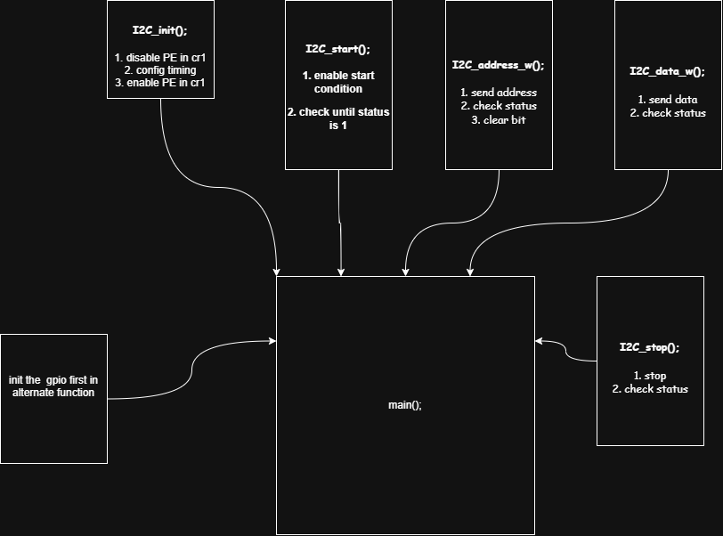

# Bare-Metal STM32F411 I2C OLED Driver

A lightweight, register-level C driver for the I2C peripheral on the STM32F411 (Black Pill) microcontroller. This project demonstrates how to initialize the I2C bus, handle the strict hardware flagging sequences, and drive an SSD1306 OLED display without relying on heavy abstraction layers like HAL or LL.

## 🚀 Features
* **Zero HAL Dependencies**: Written entirely using CMSIS register definitions.
* **Multi-Peripheral Support**: Dynamic handling for `I2C1`, `I2C2`, and `I2C3`.
* **Robust Flag Handling**: Implements the exact hardware "handshake" sequences (such as clearing the `ADDR` flag via sequential `SR1` and `SR2` reads).
* **OLED Graphics**: Includes a modular page-addressing routine to flood or clear the display buffer.

---

## 🛠️ Hardware & Protocol Architecture



The driver configures **PB6 (SCL)** and **PB7 (SDA)** into Alternate Function mode (**AF4**), driving the lines as Open-Drain. 

### Critical Hardware Behaviors Solved:
* **The ADDR Flag Stall**: In the Address Phase, the STM32 automatically pulls the `SCL` line low to pause the bus upon receiving an ACK. The driver explicitly handles this by reading `SR1` followed by `SR2` to unfreeze the line.
* **Automatic TXE Clearing**: In the Data Phase, the driver utilizes the automatic clearing of the `TXE` (Transmit Register Empty) flag by writing directly to the `DR` (Data Register), optimizing execution speed.

---

## 📁 File Structure

* `main.c` — Handles GPIO alternate function configurations, clock gating, and the OLED execution loop.
* `i2c.c` — Core I2C peripheral state-machine logic (Start, Address, Write, Stop, and Fill).
* `i2c.h` — Function prototypes and peripheral definitions.

---

## 🔧 Getting Started

### 1. Pin Configuration
Connect your SSD1306 OLED display to your Black Pill board using the following pin map:

| OLED Pin | Black Pill Pin | Function |
| :--- | :--- | :--- |
| **GND** | GND | Common Ground |
| **VCC** | 3.3V | Power Supply |
| **SCL** | PB6 | I2C1 Clock (AF4) |
| **SDA** | PB7 | I2C1 Data (AF4) |

> ⚠️ **Hardware Note**: Solid white screens (`0xFF`) draw maximum current (~20-40mA). Ensure your ground connections are solid and secure to prevent parasitic grounding or stability issues through your debugging tools!

### 2. Compilation & Flashing
Compile using your preferred toolchain (GCC ARM Embedded, Keil, or STM32CubeIDE) and flash using an ST-Link V2:
```bash
# Example using OpenOCD
openocd -f interface/stlink.cfg -f target/stm32f4x.cfg -c "program build/output.elf verify reset exit"
